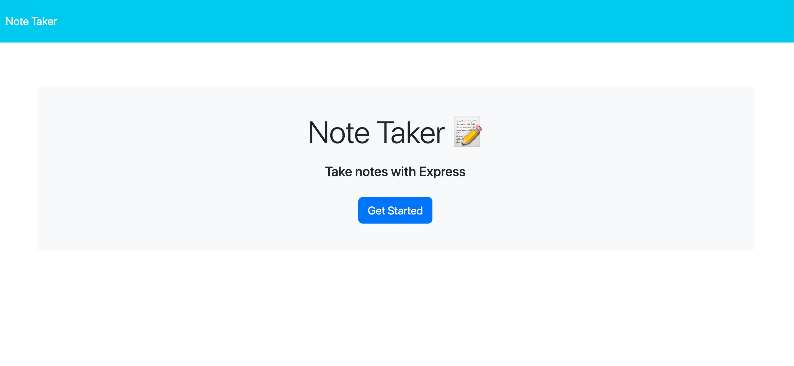

# Note-Taker

# Description

 This project creates an application called Note Taker that can be used to write and save notes. This application uses an Express.js back end and to save and retrieve note data from a JSON file.

# Installation

Clone the Note-Taker repository to your local machine. The server.js file contains the get, post and delete routes to write data to the json file, delete data from the file and retrieve the data from the file. The index.js contains the client side code of the application

# Screenshot 
The following screenshot demonstrates the application functionality:

# Link to Deployed Heroku Code
